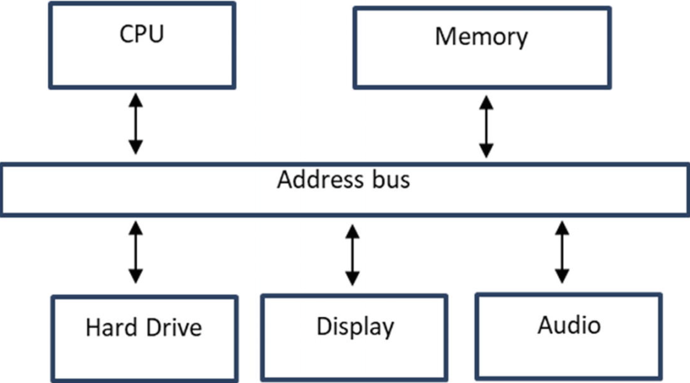

# Fundamentals of a Computer System

## von Neumann Architecture

5 elements:

1. Central Control
2. Main Memory
3. Input
4. Output
5. Recording medium

## CPU: Fetch, Decode, Execute, and Store

### Cycle of CPU

Fetch -> Decode -> Execute -> Store the result of instruction

### Elements

1. Clock ⏲️: send an electric pulse ⚡ at a regular interval
(2.5HGhz, ...)

2. Control Unit 🎛️: drives the cycle (F -> D -> E -> S)

3. Arithmetic and logic unit (ALU): performs

- math operations
- digital logic operations: AND, OR, XOR, ...

4. Internal Memory for Registers.

5. Memory Cache.

### Fetch

- CPU fetch **intructions** from **memory** using **adresses**.

- The memory has limit.

- When the CPU turns on, it starts **executing** instructions from a **specific location** as specified by the default value of its **instruction pointer**.

- The **instruction pointer** is a special memory location, called **register**, that stores the memory address of the next instruction.

- CPU work with binary [1 0].

  - [1 or 0] -> bit
  - byte -> 8 bits
  - word -> 2 bytes = 16 bits
  - dword -> 2 words

### ISA (Instruction Set Architecture)

The instruction set will have intructions for the CPU to do:

- doing arithmetic

- moving data between memory locations (resigter or main memory)

- controlling the flow of execution, ...

2 primary approaches:

- complex instruction sets (CISC):
    do more work in a single instructions and take as much time needed.

- reduced intruction sets (RISC):
    is optimized set of instructions that the CPU can excute quickly, fewer memory accesses.

**Microarchitecture of CPU** is how the instruction set is implemented.

There are multiple microarchitectures that support the same ISA

Example: Intel and AMD made chips that support x86 RSA but different implementation => Both CPUs can run exact the programs.

### Register

CPUs have special memory locations called ***register***

- To store value in the CPU that help it to excute the instructions without having to refer back the main memory.

- To store result of operations in registers.

### CPU Decode, Execute, Store

- Decoding is when the CPU interprets the instruction and transfer the data needed to excute the instruction into CPU to prepare to excute the instruction

- Instruction format:
  - opcode: the operation to be performed.
  - operands: this register or data needed for the operation.
    - the number and order of operands depend on the addressing mode.
  - addressing mode:
    - Register direct:
      - Both operands are registers:
      - ```ADD EAX, EAX```
    - Register indirect:
      - Both operands are registers, but one contains the address where the operand is stored in memory:
      - ```MOV ECX, [EBX]```
    - Imediate:
      - The operand is included immediately after the instruction in memory
      - ```ADD EAX, 10```
    - Indexed
      - The address is calculated using a base address plus an index, which can be another register
      - ```MOV AL,  [ESI+0x401000]```

- The CPU control unit decodes the instruction and then, based on the addressing scheme, move the data from the memory into the appropriate registers.
- The instruction is ready, the control unit drives the ALU to do its work.
- The ALU use many different of logic gates to implement the various instructions.

### Controlling the flow

A very important instruction is one that tells the CPU to start executing instructions from a different location, which is typically referred to as a “jump” instruction. You can program the CPU to perform calculations and then jump (change the instruction pointer) to a different location in memory based on the outcome of the calculations. This technique is used to perform a loop operation.

### Instruction Pipeline

CPUs are designed to fetch, decode, and execute instructions as efficiently as possible. The circuitry of the CPU is designed in stages that can run in parallel, called parallel execution units. For example, when the CPU is performing the second stage of an instruction, it can start executing the next instruction’s first phase. This allows the CPU to use all of its circuitry and execute instructions faster. The stages of executing an instruction are referred to as a pipeline.

### Flynn’s Taxonomy

4 classes:

1. Single instruction, single data (SISD)
2. Single instruction, multiple data (SIMD)
3. Multiple instruction, single data (MISD)
4. Multiple instruction, multiple data (MIMD)

## Main Memory and Secondary Storage

- Main memory -> Random Access Memory (RAM)
- Secondary Storage -> HDD, SSD, ...
- CPU needs to load the instructions from secondary storage into main memory

## Input and Output (I/O)

- Memory-mapped I/O:
    In modern computers, devices are connected to the same address bus as the CPU and main memory, as depicted in Figure 1-4. This enables CPU instructions to use memory addresses to perform input and output (I/O) operations with devices
    
- Interrupts:
    When a device completes its operation, it will let the CPU know it is done through an interrupt, which is a signal connected to the CPU that the device raises or lowers to get the CPU’s attention. When the CPU receives the signal, it can stop executing instructions and switch to a special routine that takes care of the interrupt.
