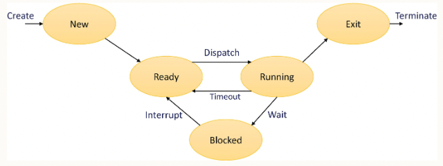
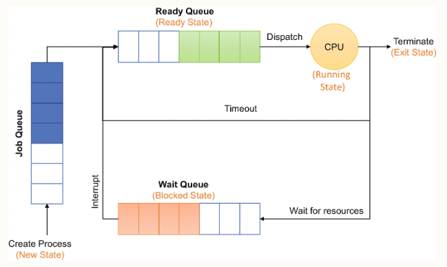

# Operating System

- OS is a program that controls the execution of other programs running on the system.
- Acts as a facilator and intermediate layer between the difference software components and the computer hardware.
- Most OSs typically have at least 2 main pieces:
  - Kernel: core part that handles the complex, low-level functionalities.
  - Libraries, applications, tools that are shipped with the OS.

## OS Categories

Based on

1. Usage type:

    - Batch
    - Time Sharing
    - Distributed
    - Network
    - Real Time
2. Design and supported features:

    - Monolithic: UNIX Flavors
    - Modular: MW, Linux Flavors, macOS
    - Microservice based: some version of RedHat OS

## OS Responsibility

- Scheduling
- Memory management
- I/O and resource management
- Access and protection
- File systems
- User interface/shell

### Scheduling

The program gets triggered to run -> the OS assign the process ID and other metrics for tracking.

The process has many states:

To manage Process and its states, OS uses data structure called Process Control Block, its includes:

- Process ID
- Process State
- Pointer: could refer to the hierarchy of processes
- Priority: the prioroty level the OS uses to determine the scheduling
- Affinity and CPU register details
- Program counter: refers to the next instruction that needs to be run
- I/O and accouting

#### Thread concepts

A thread is nothing more than a lightweight process. When a process gets executed, it could create one or more threads internally that can be executed on the processor. These threads have their own program counter, context, and register information, similar to how the process is managed.

### Memory Management
